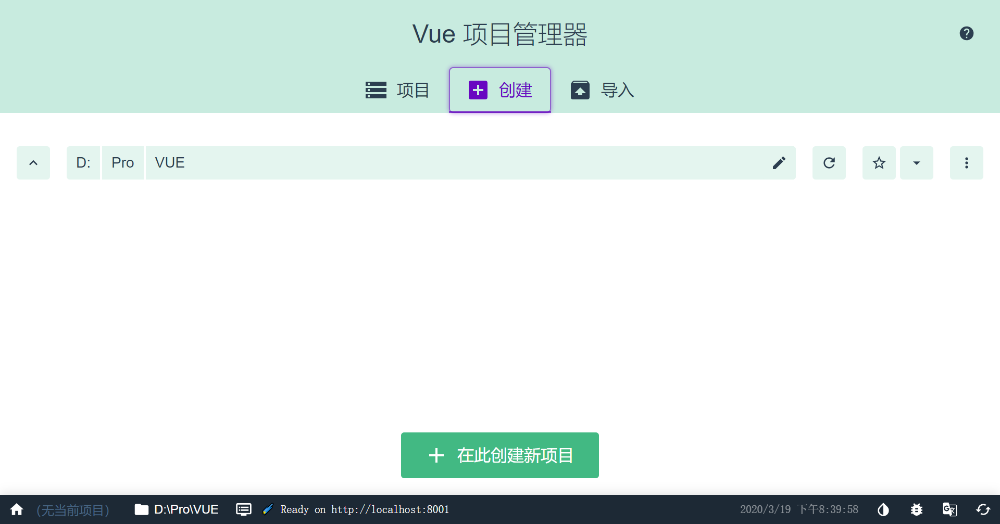
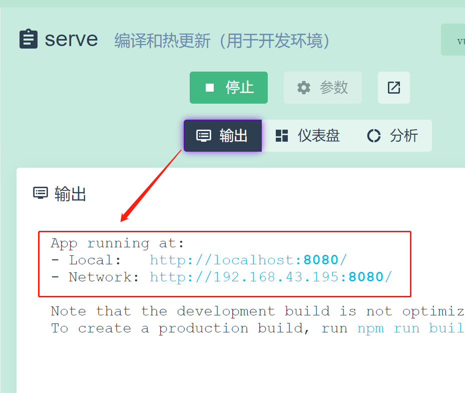
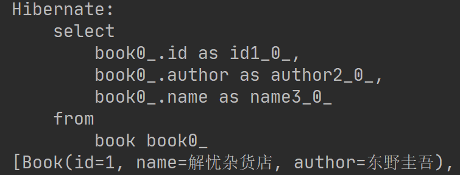
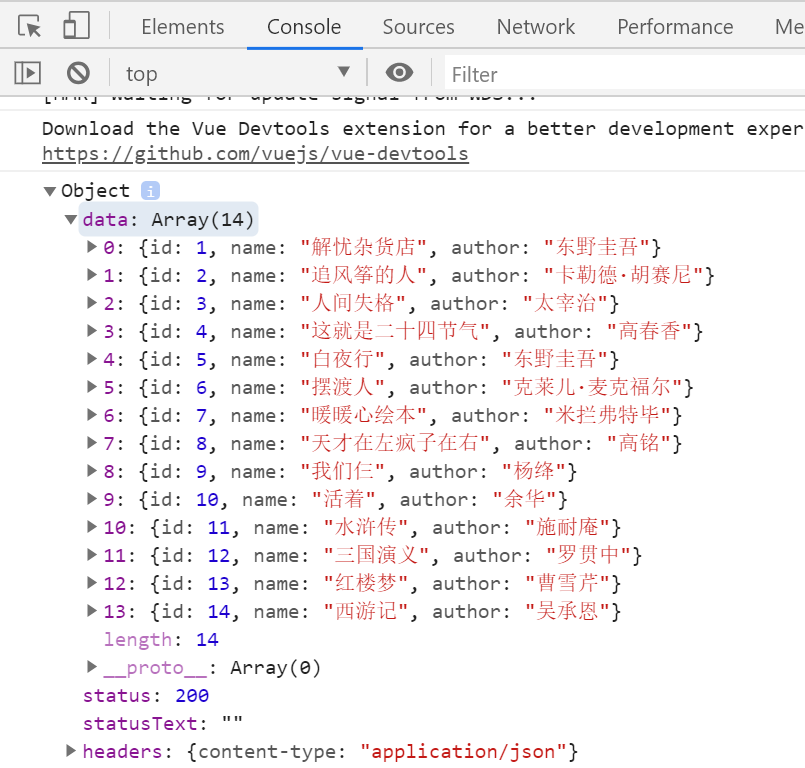

# 前后端分离的SpringBoot+Vue实战

## 前后端分离概念

前后端分离就是指将一个应用的前端代码和后端代码分开写，前端只需要独立编写客户端代码，后端也只要独立编写服务端代码提供数据接口即可，前端通过Ajax请求来访问后端的数据接口，将Model展示到View中即可。

前后端开发者只需要提前约定好接口文档(URL、参数、数据类型...)，然后分别独立开法即可，前端可以造假数据进行测试，完全不需要依赖于后端，最后完成前后端集成即可，真正实现了前后端应用的解耦合，极大的提升了开发的效率。

单体=》前端应用+后端应用

前端应用：负责数据展示和用户交互；

后端应用：负责提供数据处理接口；


前后端分离我认为就是将一个单体应用拆分成两个独立的应用，前端应用和后端应用以JSON格式进行数据交互。

## 实现技术

Spring Boot + Vue

使用Spring Boot 进行后端开发，使用Vue进行前端开发

## 创建Vue工程

1. 下载node.js安装；

2. 全局安装vue-cli，在cmd里执行：

   ```
   npm install -g vue-cli
   ```

bash命令行中输入：vue ui  可以打开图形页面创建vue工程







### 创建完毕使用IDEA导入Vue

全部勾选默认，进入项目后安装vue.js插件。


在网页版下载他的插件并导入：


这是一个单页面应用，我们通过IDEA控制台访问他：npm run serve


App.vue相当于主页面，而About与Home相当于模板一样。


通过router的index.js配置，就可以把App.vue的路径与名字对应起来：


### 创建Spring Boot应用


application.yml：

```yml
spring:
  datasource:
    url: jdbc:mysql://localhost:3306/sell?useUnicode=true&characterEncoding=UTF-8&serverTimezone=UTC
    username: root
    password: 123456
    driver-class-name: com.mysql.cj.jdbc.Driver
  jpa:
    show-sql: true
    properties:
      hibernate:
        format_sql: true
server:
  port: 8181
```

回到vue应用：

创Book.vue：


在book页面造假数据测试：

```vue
<template>
    <div>
        <table>
            <tr>
                <td>编号</td>
                <td>图书名称</td>
                <td>作者</td>
            </tr>
            <tr v-for="item in books">
                <td>{{item.id}}</td>
                <td>{{item.name}}</td>
                <td>{{item.author}}</td>
            </tr>
        </table>
        {{msg}}
    </div>
</template>

<script>
    export default {
        name: "Book",
        data(){
            return {
                msg: 'hello Vue',
                books:[
                    {
                        id:1,
                        name:'java',
                        author:'Hex3'
                    },
                    {
                        id:2,
                        name:'java2',
                        author:'Hex2'
                    },
                    {
                        id:3,
                        name:'java3',
                        author:'Hex1'
                    },
                ]
            }
        }
    }
</script>
<style scoped>
</style>
```

发现vue的URL地址带/#，解决方法：index.js中改成：

```js
const router = new VueRouter({
    mode: 'history',
    base: process.env.BASE_URL,
    routes
})
```

#### springboot使用JPA访问数据库


创建实体类Book与表对应：

```java
@Entity
@Data
public class Book {
    @Id
    private Integer id;
    private String name;
    private String author;
}
```

创建BookRepository：

```java
import com.miku.springboot.entity.Book;
import org.springframework.data.jpa.repository.JpaRepository;
//只需要继承Jpa泛型里面有各种数据库操作方法
public interface BookRepository extends JpaRepository<Book,Integer>{
}
```

右键该类名生成测试类：测试findAll方法：

```java
@SpringBootTest
class BookRepositoryTest {

    @Resource
    private BookRepository bookRepository;

    @Test
    void findAll() {
        System.out.println(bookRepository.findAll());
    }
}
```

IDEA的junit5下载太慢，去mvnrepository.com找到1.5.2依赖加到pom里：

```xml
<dependency>
    <groupId>org.junit.platform</groupId>
    <artifactId>junit-platform-launcher</artifactId>
    <version>1.5.2</version>
    <scope>test</scope>
</dependency>
```




数据不光查询出来，还看到了完整的sql语句，是因为在配置文件里配置了显示并格式化：

```yml
jpa:
  show-sql: true
  properties:
    hibernate:
      format_sql: true
```

创建cotroller：BookHandler类：


```java
@RestController
@RequestMapping("/book")
public class BookHandler {
    @Resource
    private BookRepository bookRepository;

    @RequestMapping("/findAll")
    public List<Book> findAll(){
        return bookRepository.findAll();
    }
}
```

访问：localhost:8181/book/findAll：成功得到了Json数据


#### 前端vue发送ajax请求8181端口将数据替换

vue需要一个ajax组件axios：控制台输入：vue add axios

安装完毕：


所有的方法都要写在export default 下

创建created方法，能在页面被初始化的时候就做出动作：

```js
created() {
    axios.get('http://localhost:8181/book/findAll').then(function(resp){
        console.log(resp)
    })
}
```

打开页面8080的控制台，发现跨域请求报错：


在后端springboot里面解决这个问题：

创建config：crossConfig类：配置get、head等方式都能请求8181服务：

```java
@Configuration
public class CrossConfig implements WebMvcConfigurer {
    @Override
    public void addCorsMappings(CorsRegistry registry) {
        registry.addMapping("/**")
            .allowedOrigins("*")
            .allowedMethods("GET", "HEAD", "POST", "PUT", "DELETE", "OPTIONS")
            .allowCredentials(true)
            .maxAge(3600)
            .allowedHeaders("*");
    }
}
```

~~还是需要多看源码啊，这configuration注解看的我一脸懵逼~~

现在就能顺利拿到8181中的数据了：



##### 将response里的data赋到books数组里

```js
created() {
    const _this = this
    axios.get('http://localhost:8181/book/findAll').then(function(resp){
        _this.books = resp.data
    })
}
```


成功显示数据

## Element UI的使用

新建vue工程，并集成Element UI。名称：vuetest

与之前配置相同，然后安装插件：


安装完毕后，IDEA导入工程，控制台启动 -> npm run serve：

打开页面，出现按钮表示安装成功

具体使用方式访问官网：element.eleme.cn/#/zh-CN；

我们搭建的是后台管理系统，主要标签：

- el-container：构建整个页面框架；

- el-aside：构建左侧菜单；

- el-menu：左侧菜单内容，常用属性：

  :default-openeds：默认展开的菜单，通过菜单的Index值来关联；

  :default-active：默认选中的菜单，通过菜单的Index值来关联；

- el-submenu：可展开的菜单，常用属性：

  index：菜单的下标，文本类型，不能是数值类型。

  

  

